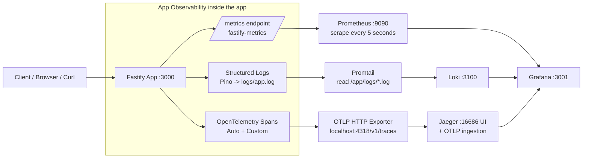

This is a high-level observability flowchart for the project (based on `Fastify + Prometheus + Loki/Promtail + Jaeger + Grafana`):

Overall flow:

- Each request enters `Fastify`, and **three signals** are produced at the same time: Metrics, Logs, and Traces.
- **Metrics** are exposed via the `/metrics` endpoint and scraped by Prometheus.
- **Logs** are written to `logs/app.log`, collected by Promtail, and sent to Loki.
- **Traces** are generated with OpenTelemetry (automatic + custom spans such as `/work`) and sent to Jaeger via OTLP.
- **Grafana** is the observability/dashboard layer that displays Prometheus and Loki data together (and Jaeger too, if the datasource is configured).
