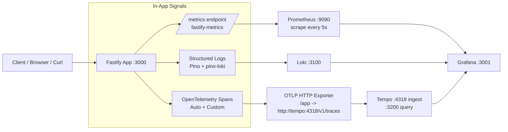

# Observability Architecture (Updated Stack)

این پروژه الان با استک زیر کار می‌کند:

- Fastify (app)
- Prometheus (metrics)
- Loki + pino-loki (logs)
- Tempo (traces)
- Grafana (dashboards + explore)

> نکته: `Jaeger` حذف شده و tracing backend اصلی پروژه `Tempo` است.

## Flow خلاصه

- هر request وارد Fastify می‌شود و هم‌زمان سه سیگنال تولید می‌شود: `Metrics`, `Logs`, `Traces`.
- متریک‌ها از `/metrics` توسط Prometheus scrape می‌شوند.
- لاگ‌ها توسط `pino-loki` مستقیما از اپلیکیشن به Loki ارسال می‌شوند.
- تریس‌ها با OpenTelemetry تولید و از OTLP به Tempo فرستاده می‌شوند.
- Grafana روی هر سه datasource (Prometheus/Loki/Tempo) دید یکپارچه ارائه می‌دهد.

## فایل‌های کلیدی

- `observability/prometheus/prometheus.yml`
- `observability/tempo/tempo.yml`
- `observability/grafana/provisioning/datasources/datasources.yml`
- `observability/grafana/provisioning/dashboards/dashboards.yml`
- `observability/grafana/dashboards/*.json`
